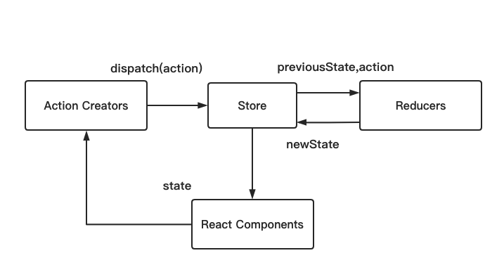
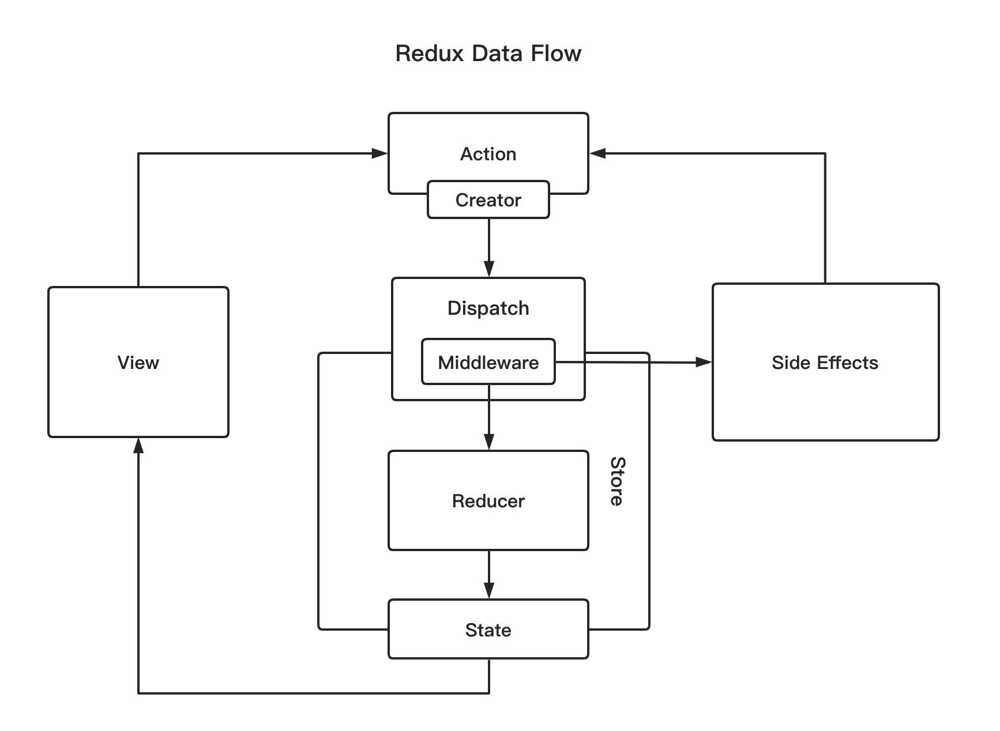

React Components 指的就是 component 组件

Store 指的就是存储数据的公共区域

这个过程就像在图书馆借书的一个过程

`React Components` 代表的是一个借书的用户，当我在图书馆借书的时候，我要跟图书馆管理员说我要借什么书，这个语境表达就是 `Action Creators`，可以理解为你说的那句话：你要借什么书，图书馆的管理员就是 `Store`，负责整个图书馆的图书管理，图书馆的管理员是没办法记住图书馆所有图书的存放，一般都有一个系统，你要借什么书，都会先查一下书有没有，这个系统就是 `Reducers` 。

## Redux 使用

1. `store` 是唯一的
2. 只有 `store` 能够改变自己的内容
3. `Reducer` 必须是纯函数
   - 纯函数指的是，给定固定的输入，就一定会有固定的输出，而且不会有任何副作用

安装

```bash
yarn add redux
```

新建 `store/index.js`

```jsx
import { createStore } from "redux";
import reducer from "./reducer";

const store = createStore(reducer);
export default store;
```

新建 `store/reducer.js`

```jsx
// 根据业务设置默认数据
const defaultState = {
  inputValue: "",
  list: [],
};
/**
 *
 * state 整个 store 的数据，修改前的 store
 * action 传递过来的 action
 */
export default (state = defaultState, action) => {
  if (action.type === "change_input_value") {
    const newState = JSON.parse(JSON.stringify(state));
    newState.inputValue = action.value;
    return newState;
  }
  return state;
};
// Tip: reducer 可以接受 state，但是绝不能修改 state
```

使用

```jsx
store.getState() // 读取

const action = {
	type: 'change_input_value',
	value: e.target.value
}
store.dispatch(action)

store.subscribe(this.handleChange) // 组件订阅 store，传递一个函数，只要 store 数据改变，这个函数就会被执行
handleChange(){
	this.setState(store.getState())
}
```

### 拆分 actionTypes

新建 `store/actionTypes`

```jsx
export const CHANGE_INPUT_VALUE = change_input_value;
```

### 拆分 actionCreators

新建 `store/actionCreators`

```jsx
import {CHANGE_INPUT_VALUE} from './actionTypes'
export const getInputChangeAction = (value) => ({
	type: CHANGE_INPUT_VALUE
	value
})
```

## 使用 React-thunk 中间件发送 ajax 请求

```jsx
// actionCreators
export const initListAction = (data) => ({
	type: INIT_LIST_ACTION,
	data
})

export const getTodoList = () => {
	return (dispatch) => {
		axios.get('/list.json').then(res => {
			const data = res.data
			const action = initListAction(data)
			dispatch(action)
		})
	}
}

// 组件
componentDidMount() {
	const action = getTodoList()
	store.dispatch(action)
}
```

## 什么是 Redux 中间件



View 在 Redux 中会派发一个 Action，Action 通过 Store 的 Dispatch 方法传递给 Store，Store 接收到 Action，连同之前的 State 一起传给 Reducer，Reducer 返回一个新的数据给 Store，Store 去改变自己的 State，这是 Redux 的一个标准流程。

Redux 的中间件在这个流程里面指的是 Action 和 Store 之间，在 Redux 中，Action 只能是一个对象，所以 Action 是一个对象直接派发给了 Store，当使用了 Redux-thunk 之后，Action 可以是函数，Action 通过 Dispatch 方法传递给 Store，那么 Action 和 Store 之间是谁？是不是就是 Dispatch 这个方法，实际上我们说的中间件指的是对 Dispatch 方法的封装。

当我们对 Dispatch 方法封装之后，比如说使用 redux-thunk 这个中间件，这个时候当你调用 Dispatch 方法，给 Dispatch 方法传递的参数是对象的话，那么 Dispatch 方法就会把这个对象直接传给 Store；这时候，假如你传给 Dispatch 方法是一个函数时，就不会把这个函数直接传递给 Store，它会让这个函数先执行，执行完之后需要调用 Store 时，这个函数在去调用 Store

## Redux-saga 中间件

新建 `store/sagas.js`

```jsx
// actionCreators.js
export const initListAction = (data) => ({
  type: INIT_LIST_ACTION,
  data,
});

// store/sagas.js
import { takeEvery, put } from "redux-saga/effects";
import { GET_INIT_LIST } from "./actionTypes";

function* getInitList() {
  const res = yield axios.get("/list.json");
  const action = initListAction(data);
  yield put(action);
}

function* todoSagas() {
  yield takeEvery("GET_INIT_LIST", getInitList);
}

export default todoSagas;
```

```jsx
// store/index.js
import createSageMiddleware from "redux-sage";
import todoSagas from "./sagas.js";

const sageMiddleware = createSagaMiddleware();
const composeEnhancers =
  window.__REDUX_DEVTOOLS_EXTENSION__ && window.__REDUX_DEVTOOLS_EXTENSION__();
const enhancer = composeEnhancers(applyMiddleware(sageMiddleware));

const store = createStore(reducer, enhancer);
sagaMiddleware.run(todoSagas);

export default store;
```

```jsx
// 组件
componentDidMount() {
	const action = getTodoList()
	store.dispatch(action)
}
```

## Redux 实际应用

```jsx
// index.js
import store from "./store";
const App = () => {
  <Provider store={store}>
    <TodoList />
  </Provider>;
};

// 组件
import React, { Component } from "react";
import { connect } from "react-redux";

class TodoList extends Component {
  render() {
    <div>
      <div>
        <input
          value={this.props.inputValue}
          onChange={this.props.changeInputValue}
        />
        <button>提交</button>
      </div>
    </div>;
  }
}

const mapStateToProps = (state) => {
  return {
    inputValue: state.inputValue,
  };
};

const mapDispatchToProps = (dispatch) => {
  return {
    changeInputValue(e) {
      const action = {
        type: "change_input_value",
        value: e.target.value,
      };
      dispatch(action);
    },
  };
};

export default connect(mapStateToProps, mapDispatchToProps)(TodoList);

// reducers.js
export default (state = defaultState, action) => {
  if (action.type === "change_input_value") {
    const newState = JSON.parse(JSON.stringify(state));
    newState.inputValue = action.value;
    return newState;
  }
  return state;
};
```
