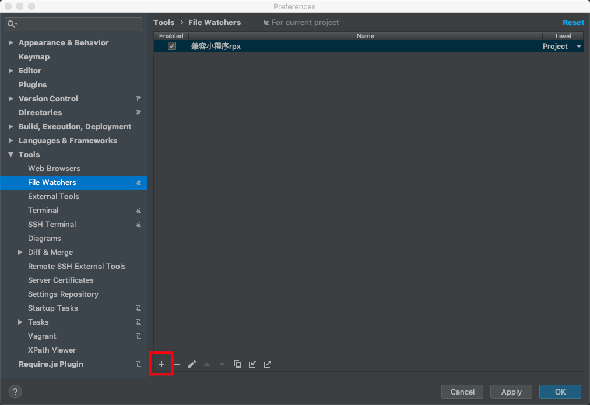
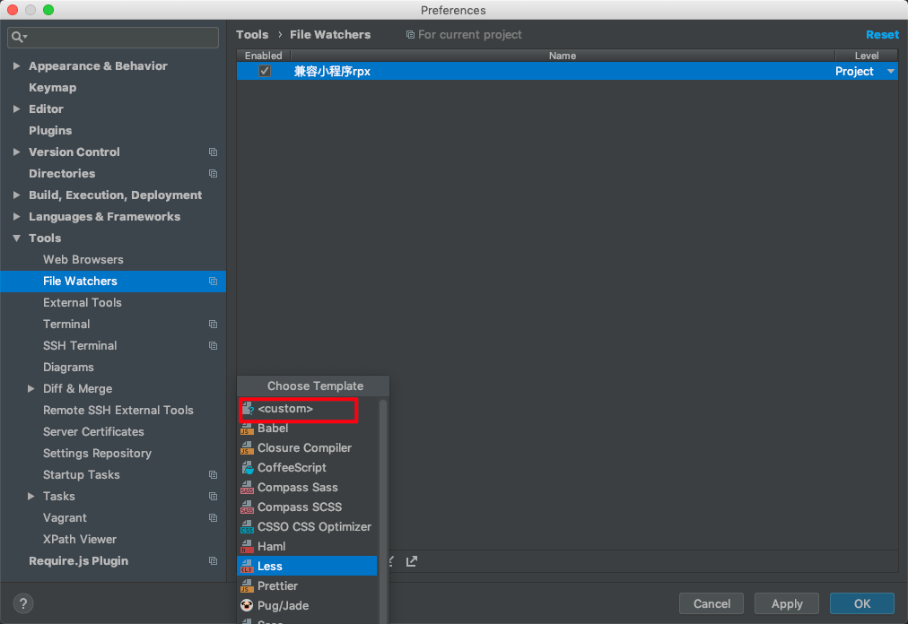
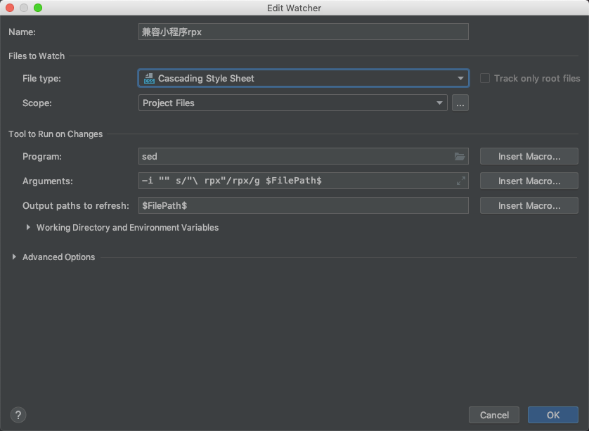
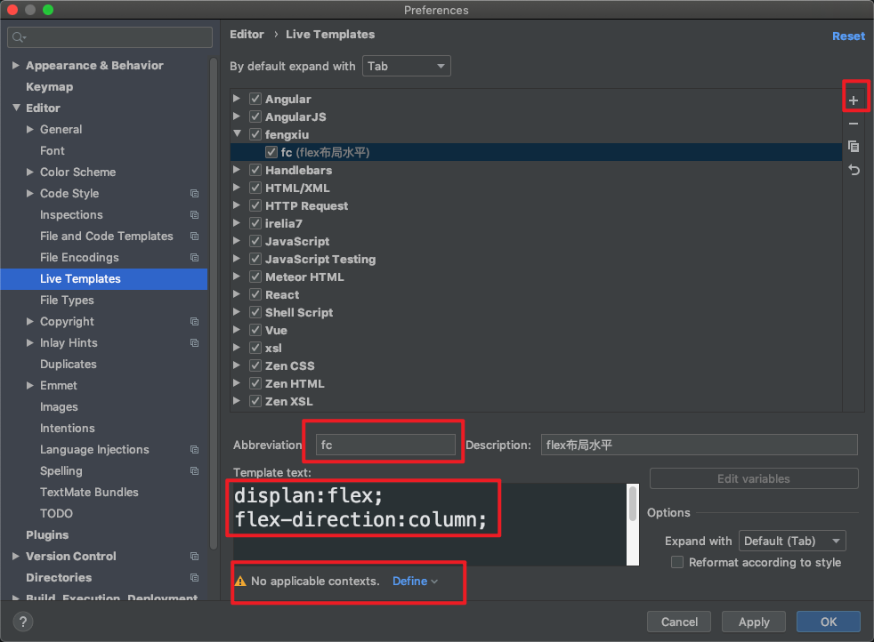
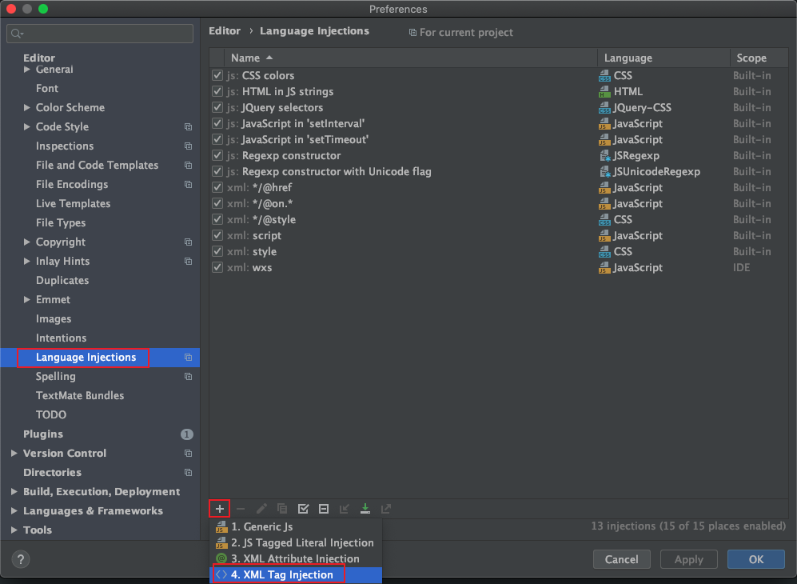
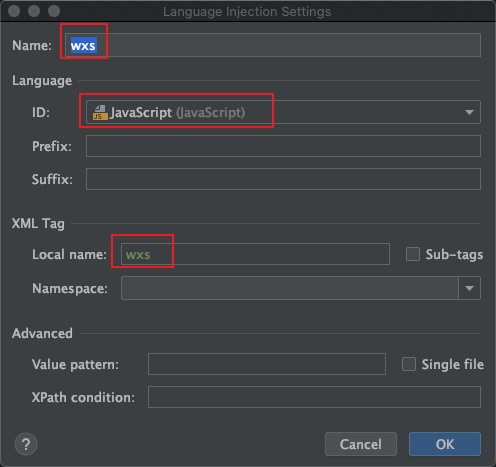

## webstorm 兼容小程序

在`file type`中添加`wxml`和`wxss`后缀名。

## wxss 适配

在`wxss`中格式化代码，数值和`rpx`中间会有空格

解决方法：

- 搜索`file watches`
- 新建一个监听器
  - `sed`
  - `-i "" s/"\ rpx"/rpx/g $FilePath$`
  - `$FilePath$`
    





## 代码片段简写

`editor` -> `live Templates`

- `$END$` 最终停在的位置
- `$VAR$: $VAR2$` 光标首先停在`VAR1`处，第 2 次停在`VAR2`处



## `wxml`中配置`wxs`标签内语法高亮





## 插件

- `key promoter x`快捷键提示
- `emacsIDEAs` 跳单词

## 修改`git`高亮提示

搜索`highlight`

```js
highlight modified lines in gutter // 打钩
```

## 快捷键

```js
file and code templates   // 新建文件自定义模版
recent file  //最近使用的文件
bookmark    //书签
favorites   //收藏列表
add to favorites    //收藏
toggle case   //大小写
postfix     //快捷操作
previous change   //跳转修改的地方
reformat code   //格式化代码
show context actions //补全代码依赖
complete current statement // 补全代码
```

## `Vue`中在`css`中使用`@`

搜索：`Languages & Frameworks` -> `webapck`

配置：

找到当前项目 -> `node_modules/@vue/cli-service/webpack.config.js`

## webstorm 缓存

删除`webstorm`缓存

```bash
cd ~/Libaray/Preference

rm -rf WebStorm2019.3
```
